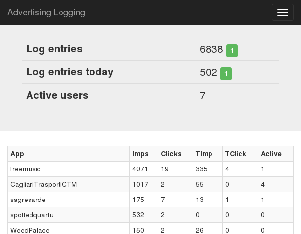

Realtime Inner-active.org Logger
================================

This is a realtime logger for inner-active.org adv service, that use jQuery, php and Bootstrap. Try a [Demo](http://sagregna.it/advlog).



Installation
------------

Put the sources on a public directory in your server, create a file named "log.txt" in the same directory, and give it read/write permissions.

Go to the inner-active.org publisher dashboard, click on demand control, and in 'Tracking' section puts these urls:

```
http://$yourserverdir$/log.php?type=imp&ip=$ip$&timestamp=$timestamp$&networkName=$networkName$&country=$country$&city=$city$&os=$os$&appname=$appname$&age=$age$&model=$model$&brand=$brand$
```

```
http://$yourserverdir$/log.php?type=click&ip=$ip$&timestamp=$timestamp$&networkName=$networkName$&country=$country$&city=$city$&os=$os$&appname=$appname$&age=$age$&model=$model$&brand=$brand$
```

For impressions and click respectly.


